# 💫 About Me:
🎓 CS & Cognitive Science undergrad at Johns Hopkins University. 💻 Passionate about building AI-driven software and exploring Deep Learning. 🧠 Interests: Computer Vision, NLP 🛠️ Currently working with Python, React, and LLMs.

# 💻 Tech Stack:
            
# 📊 GitHub Stats:
 
 

---

<!-- Proudly created with GPRM ( https://gprm.itsvg.in ) -->
